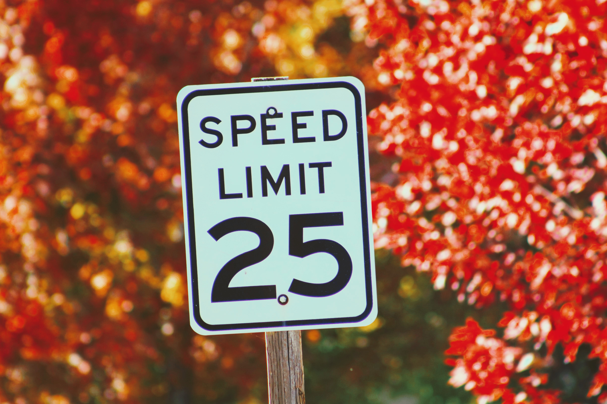

# traffic-sign-recognition

## Table of Contents

1. [Introduction](#introduction)
2. [Dataset](#data)
3. [Blog Post](#blog)
4. [Acknowledgements](#acknowledgements)

## Introduction

Traffic sign recognition is one of the features of the modern assisted control system used on a motor vehicle. To correctly recognize a traffic sign is vital for driving safety. We will build a deep learning neural network, specifically convolutional neural network (CNN), to identify the traffic sign images. 

## Dataset

This is an image classification task and originated from Kaggle, so traffic signs are all in image form. Note that the dataset size is quite large, so one can find the dataset on [Kaggle here](https://www.kaggle.com/meowmeowmeowmeowmeow/gtsrb-german-traffic-sign).

## Blog Post

The main findings of the project can be found at the blog post available [here](https://alexjin48.medium.com/traffic-signs-recognition-using-cnn-with-tensorflow-keras-bfb69e37e249).

## Acknowledgements

One can find the dataset and data overview [here](https://www.kaggle.com/meowmeowmeowmeowmeow/gtsrb-german-traffic-sign).

[Back to top](#top)
